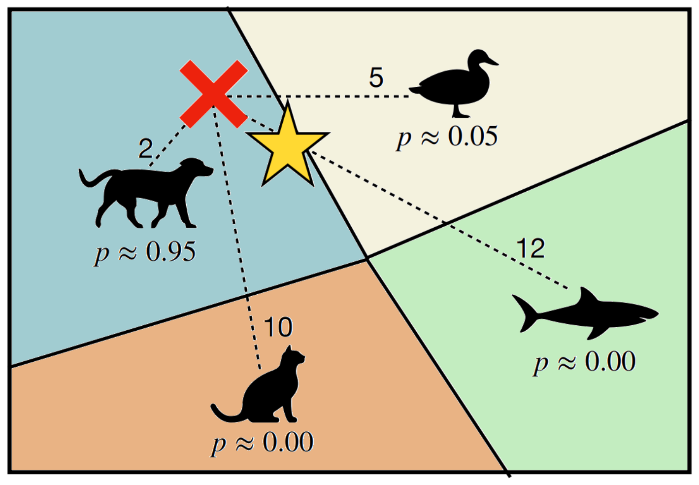
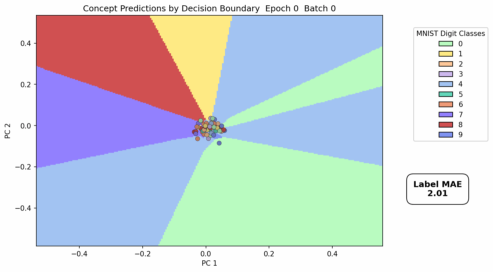
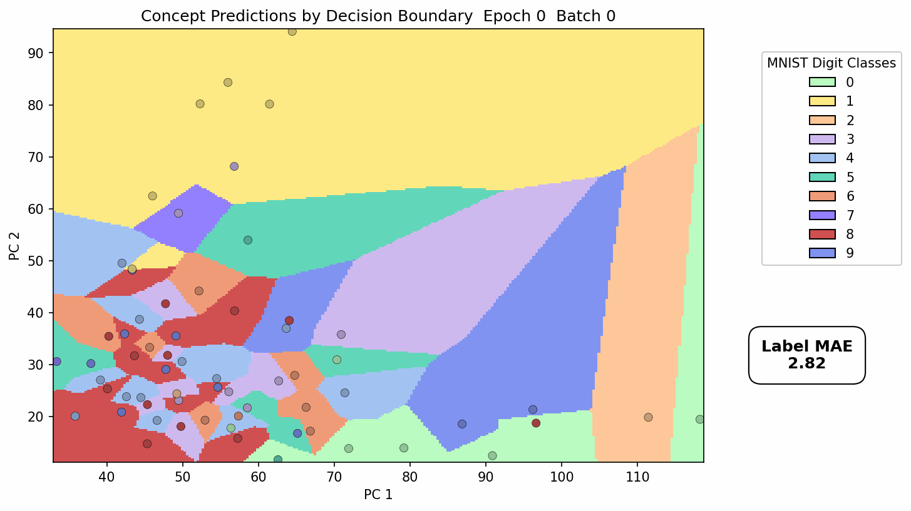

# Right for the Right Reasons: Avoiding Reasoning Shortcuts via Prototypical Neurosymbolic AI

This is the codebase for the Paper

Andolfi, L. and Giunchiglia, E., 2025. ”Right for the
Right Reasons: Avoiding Reasoning Shortcuts via Prototypical Neurosymbolic AI.” Accepted at The
Thirty-Ninth Annual Conference on Neural Information Processing Systems (NeurIPS 2025).

```bibtex
@misc{r4rr,
      title={Right for the Right Reasons: Avoiding Reasoning Shortcuts via Prototypical Neurosymbolic AI}, 
      author={Luca Andolfi and Eleonora Giunchiglia},
      year={2025},
      eprint={2510.25497},
      archivePrefix={arXiv},
      primaryClass={cs.LG},
      url={https://arxiv.org/abs/2510.25497}, 
}
```

If you find the code useful, please consider citing it.

## Abstract

Neurosymbolic AI is growing in popularity thanks to its ability to combine neural perception and symbolic reasoning in end-to-end trainable models. 
However, recent findings reveal these are prone to shortcut reasoning, i.e., to learning unindented concepts--or neural predicates--which exploit spurious correlations to satisfy the symbolic constraints. In this paper, we address reasoning shortcuts at their root cause and we introduce prototypical neurosymbolic architectures. These models are able to satisfy the symbolic constraints **be right** because they have learnt the correct basic concepts for the 
**right reasons** and not because of spurious correlations, even in extremely low data regimes. Leveraging the theory of prototypical learning, we demonstrate that we can effectively avoid reasoning shortcuts by training the models to satisfy the background knowledge while taking into account the similarity of the input with respect to the handful of labelled datapoints. We extensively validate our approach on the recently proposed rsbench benchmark suite in a 
variety of settings and tasks with very scarce supervision: we show significant improvements in learning the right concepts both in synthetic tasks (\texttt{MNIST-EvenOdd} and \texttt{Kand-Logic}) and real-world, high-stake ones 
BDD-OIA. Our findings pave the way to prototype grounding as an effective, annotation-efficient strategy for safe and reliable neurosymbolic learning.

## Concrete Examples

### Prototypical Grounding...
  
  <!-- OR to control size -->
  <!--  -->

Suppose we have a concept space defined as:

- **[h₁] = {Dog, Cat, Duck, Shark}**  
- **[h₂] = {Mammal, Bird, Fish}**

We define the background symbolic knowledge as:

```text
(Dog ∨ Cat → Mammal) ∧ (Duck → Bird) ∧ (Shark → Fish)
```

Now, let’s consider an input image x of a dog.

Its embedding z₁, computed by a prototypical extractor for *[h_1]*, is compared against the centroids (or prototypes) for each concept. For this image, the squared distances from z₁ to the class centroids correspond to the numbers shown next to the dotted lines in Figure above. The center of belief (i.e. the average over all the prototypes representing the classes in *[h_i]* weighted by the probability assigned to each class by the model) for x with respect to [h₁] is shown as a ⭐ symbol in the figure.

Assume the embedding z₂, computed by a prototypical extractor for *[h_2]*, has the following distances to prototypes:

| Prototype | Distance |
|---|---:|
| Mammal | 2.0 |
| Bird   | 3.0 |
| Fish   | 4.0 |

The semantic loss computed by our method produces errors with approximate magnitudes:

| Concept | Error magnitude |
|---|---:|
| Dog   | ~2.0 |
| Cat   | ~0.3 |
| Duck  | ~0.25 |
| Shark | ~5×10⁻⁴ |

These values reflect how much each centroid contributes to the class prediction — closer and semantically consistent prototypes yield smaller errors.

In contrast, a standard neural network trained with semantic loss (but without prototypical grounding) would produce nearly uniform error magnitudes of ~1.0 across all outputs, ignoring semantic structure.

### ...and how it makes a difference

The following GIF shows a sequence of PCA projections for the logits of the standard Semantic Loss model when trained on MNIST-EvenOdd. 
Decision boundaries are colored by the models' predictions, and the points--representing the unsupervised digit concepts--are shown with their ground truth. 



We can see the model learns to classify all digits as either 3,4 or 6. Most of the points fall into the **wrong** class, but the *Mean Absolute Error* shown on the right constantly decreases.
This shows the model is actually learning to correctly predict the sum of the digits by arranging all points in class 3,4 and 6.
Thus, this model is **right for the wrong reason**.

Now, compare the previous behaviour with the one of the *prototypical Semantic Loss model* trained on the same data from MNIST-EvenOdd.



The model leverages prototypical representatives for each class to learn how to cluster the datapoints, both minimising distances to class centroids **and** the semantic loss objective. 
We clearly see the model is using *all* the concepts to classify the digits and the predictions are well-separated in the logits space across the classes.
Notably, eventually all the points fall inside the class boundary matching their respective color. While doing so, the mean absolute error converges to zero, showing the model is also learning
to correctly predict the final label. This model is **right for the right reason**.

## Acknowledgments

This codebase builds on top of [rsbench: A Neuro-Symbolic Benchmark Suite for Concept Quality and Reasoning Shortcuts](https://unitn-sml.github.io/rsbench/) and it uses its evaluation methods.
All ready-made data sets and generated datasets are distributed under the CC-BY-SA 4.0 license, with the exception of *Kand-Logic*, which is derived from *Kandinsky-patterns* and is distributed under the GPL-3.0 license. 
Most of the code in the repo is distributed under the BSD 3 license, with the exception of *Kand-Logic*, which is derived from *Kandinsky-patterns* and as such is distributed under the GPL-3.0 license.

## Tasks 

The tasks belong to rs-bench benchmark suite. 

**MNIST-EvenOdd**. The dataset presents a more complex version of the standard MNIST-Addition task. Each input is a pair of handwritten 28 x 28 digits labelled with their sum (background knowledge). 
The goal is to correctly classify the digits (concepts) while predicting their sum (final label). 
Notably, the restricted support is designed to stir up shortcut reasoning, with a total of 49 distinct RSs a model may take. 
Since the training support is incomplete, thus shortcuts cannot be avoided by simply processing each digit in isolation. 
During training only 16 possible pairs of digits out of 100 are given - 8 comprising only even digits and 8 only odd digits - while at test time the model is presented with out-of-distribution pairs. 
Overall, the training set contains 6720 data, the validation set 1920, and the test set 960.

**Kand-Logic**: Inspired by the artworks of Wassily Kandinsky, this task involves non-trivial perception to classify shapes and colors, and logical reasoning to infer patterns among them. 
In particular, the task features the shape and color of geometric primitives (concepts), possibly defining a pattern to be predicted (final label).
The goal is to correctly classify the primitives (concepts) while predicting their pattern (final label).
Each datapoint consists of three 64 x 64 images, representing three geometric primitives each.
Every sample is labelled as 1 whether all images either include the same number 

**BDD-OIA**: This real-world and high-stake autonomous driving dataset was originally proposed as an extension of BDD-100k and contains a total of about 22.5k frames captured from the ego-vehicle. 
Each frame, whose size is 720 x 1280, receives labels from *MoveForward*, *Stop*, *TurnLeft*, *TurnRight* to reflect the right action to be undertaken. 
The goal is to correctly classify the reasons (concepts) behind each action.
Frames are processed using a Faster-RCNN model and the first pre-trained layer from a concept bottleneck model so as to obtain 2048-dimensional embeddings expressing the features present in each training scene. These embeddings are then used to train the NeSy models. Each frame (or equivalently, embedding) is annotated with one of 4 possible labels *MoveForward*, *Stop*, *TurnLeft*, *TurnRight*, each indicating a possible action taken by the ego-vehicle. The learning task, differently from the previous ones, is multi-label: multiple different actions can be labelled as possible in the provided scene with the only exception of *MoveForward* and *Stop* that are clearly mutually exclusive choices. Additionally, each embedding is annotated with a subset of the 21 concepts that might cause the action.


## Quickstart — what you need to run everything

Prerequisites
- Python 3.8+ (tested with Python 3.8 / PyTorch 1.13 in the notebooks)
- GPU + CUDA (recommended) or CPU only (slower)
- Install Python deps:
  ```sh
  pip install -r [requirements.txt](requirements.txt)
  ```
  See [requirements.txt](requirements.txt).
- Optionally create a conda env and install the requirements file.

Repository layout (top-level)
- [backbones/](backbones/) — model backbone implementations (CNNs, Protonet encoders). See specific Protonet files below.
- [datasets/](datasets/) — dataset loaders used by notebooks and scripts.
- [models/](models/) — high-level models that compose backbones and losses.
- [shortcut_mitigation/](shortcut_mitigation/) — main experimental code, notebooks and utilities for MNIST, Kandinsky and BDDOIA experiments (see sections below).
- [evaluation/](evaluation/) — evaluation notebooks and scripts (e.g. [evaluation/evaluate.ipynb](evaluation/evaluate.ipynb), [evaluation/run_evaluations.py](evaluation/run_evaluations.py)).
- [requirements.txt](requirements.txt) — Python dependencies.

Key files you will likely run directly
- MNIST-EvenOdd (main arguments in *protonet_mnist_add_modules/arguments.py* and experimental setup in *protonet_mnist_add_modules/utility_modules/setup.py*):
  - [`shortcut_mitigation/mnist/main_protonet_mnist.py`](shortcut_mitigation/mnist/main_protonet_mnist.py) to run the prototypical models for this task;
  - [`shortcut_mitigation/mnist/main_pretrained_baseline_even_odd`](shortcut_mitigation/mnist/main_pretrained_baseline_even_odd.py) to run the standard pretrained models in different configurations (see *setup* file);
  - [`shortcut_mitigation/mnist/main_nn_augs`](shortcut_mitigation/mnist/main_nn_augs.py) to run standard models supervised with the support sets in different configurations (see *setup* file);
- Kandinsky (main arguments in *protonet_kand_modules/arguments.py* and experimental setup in *protonet_kand_modules/utility_modules/setup.py*):
  - [`shortcut_mitigation/kandinsky/main_protonet_kand.py`](shortcut_mitigation/kandinsky/main_protonet_kand.py) to run the prototypical models for this task;
  - [`shortcut_mitigation/kandinsky/main_nn_augs.py`](shortcut_mitigation/kandinsky/main_nn_augs.py) to run standard models supervised with the support sets in different configurations (see *setup* file);
  - [`shortcut_mitigation/kandinsky/main_baseline_joint.py`](shortcut_mitigation/kandinsky/main_baseline_joint.py) to run standard models disentangled with respect to inputs in different configurations (see *setup* file);
  - [`shortcut_mitigation/kandinsky/main_baseline_dis.py`](shortcut_mitigation/kandinsky/main_baseline_dis.py) to run standard models disentangled with respect to inputs and predicates in different configurations (see *setup* file);
- BDDOIA (main arguments in *protonet_bddoia_modules/arguments.py* and experimental setup in *protonet_bddoia_modules/utility_modules/setup.py*):
  - [`shortcut_mitigation/bddoia/main_protonet.py`](shortcut_mitigation/bddoia/main_protonet.py) to run the prototypical models for this task;
  - [`shortcut_mitigation/bddoia/main_baseline_joint.py`](shortcut_mitigation/bddoia/main_baseline_joint.py) to run standard models disentangled with respect to inputsin different configurations (see *setup* file);
  - [`shortcut_mitigation/bddoia/main_baseline_disj.py`](shortcut_mitigation/bddoia/main_baseline_disj.py) to run standard models disentangled with respect to inputs and predicates in different configurations (see *setup* file);
- For each experiments you may prefer running the relative notebook. All notebooks are under:
  - [`shortcut_mitigation/mnist/notebooks/`](shortcut_mitigation/mnist/notebooks/)
  - [`shortcut_mitigation/kandinsky/notebooks/`](shortcut_mitigation/kandinsky/notebooks/)
  - [`shortcut_mitigation/bddoia/notebooks/`](shortcut_mitigation/bddoia/notebooks/)


## Other resources related to Prototypical Networks
These are the primary Protonet-related backbones:

- [`backbones.addmnist_protonet.PrototypicalLoss`](backbones/addmnist_protonet.py) — prototypical-loss/backbone for ADDMNIST experiments.
- [`backbones.kand_protonet.PrototypicalLoss`](backbones/kand_protonet.py) — Protonet backbone used for Kandinsky experiments.
- [`backbones.bddoia_protonet.PrototypicalLoss`](backbones/bddoia_protonet.py) — Protonet backbone for BDDOIA experiments.

Prototypical-data and helper modules (used by notebooks & scripts)
- See the prototypical data creation / helpers inside the `shortcut_mitigation/*/` modules (notebooks and proto modules referenced inside each experiment folder). Example helper functions referenced in notebooks:
  - `choose_initial_prototypes` / `get_original_support_query_set` / `get_augmented_support_query_set` — used to construct support/query sets for prototypical training (see the notebooks and proto_data files under each dataset folder).

---

## Data

As a general rule the dataset loaders expect data under a local `data/` directory (relative to repo root) or inside the dataset-specific paths referenced by the loaders. 
How to check exact loader expectations:
- Inspect the dataset loader modules in [datasets/](datasets/) for the exact filenames and structure they require.

When running the main scripts described above and the notebooks for each task, the data folder should be placed within the folder relative to the task.
All data can be found at [rsbench: A Neuro-Symbolic Benchmark Suite for Concept Quality and Reasoning Shortcuts](https://unitn-sml.github.io/rsbench/)

---

## How to run the project (general steps)

1. Install requirements:
   ```sh
   pip install -r [requirements.txt](requirements.txt)
   ```
2. Put datasets into `data/` as described above.
3. Run a notebook or script: To run a script entrypoint use:
   ```sh
   python shortcut_mitigation/mnist/main_protonet_mnist.py
   python shortcut_mitigation/kandinsky/main_protonet_kand.py
   python shortcut_mitigation/bddoia/main_protonet.py
   ```
   Each script reads argument defaults from its local arguments module (see the per-experiment argument files linked below).
---

## Detailed instructions per experiment (MNIST, Kandinsky, BDDOIA)

Note: each experiment contains a `notebooks/` subfolder. The notebooks are the recommended starting points for reproducing experiments.

### MNIST (shortcut_mitigation/mnist)
- Notebooks:
  - [`shortcut_mitigation/mnist/notebooks/protonet.ipynb`](shortcut_mitigation/mnist/notebooks/protonet.ipynb)
  - [`shortcut_mitigation/mnist/notebooks/math_proto.ipynb`](shortcut_mitigation/mnist/notebooks/math_proto.ipynb) (generalization of MNIST-EvenOdd)
- Entry script:
  - [`shortcut_mitigation/mnist/main_protonet_mnist.py`](shortcut_mitigation/mnist/main_protonet_mnist.py)
- Important argument/config modules:
  - [`shortcut_mitigation/mnist/protonet_mnist_add_modules/arguments.py`](shortcut_mitigation/mnist/protonet_mnist_add_modules/arguments.py) — default args (prototypes, batch sizes, seeds).
- How to run (recommended):
  1. Open [`protonet.ipynb`](shortcut_mitigation/mnist/notebooks/protonet.ipynb). This notebook (and the other ones) typically set:
     ```py
     os.environ['CUDA_VISIBLE_DEVICES'] = GPU_ID
     sys.path.append(os.path.abspath(".."))
     ```
  2. Inspect the first cells to set `GPU_ID`, `seed`, `model_parameter_name` etc. Run cells in order.
  3. If you prefer to run the scripts directly (uses args modules as defaults):
     ```sh
     python shortcut_mitigation/mnist/main_protonet_mnist.py 
     ```
     (The script reads dataset and prototypical options from the `protonet_mnist_add_modules` arguments module.)

- Data required:
  - `2mnist_10digits` (or loader-specific paths). Check [datasets/addmnist.py](datasets/addmnist.py).
- Protonet pieces used: 
  - Backbone: [`backbones.addmnist_protonet`](backbones/addmnist_protonet.py)
  - Proto helpers referenced in notebooks: functions named like `choose_initial_prototypes`, `get_augmented_support_query_set` in the protonet data modules inside `shortcut_mitigation/mnist/` (see the notebooks for exact imports).

### Kandinsky (shortcut_mitigation/kandinsky)
- Notebooks:
  - [`shortcut_mitigation/kandinsky/notebooks/main.ipynb`](shortcut_mitigation/kandinsky/notebooks/main.ipynb)
  - Other analysis notebooks in that folder (yolo training, prototypes, nn_augs, etc.)
- Entry script:
  - [`shortcut_mitigation/kandinsky/main_protonet_kand.py`](shortcut_mitigation/kandinsky/main_protonet_kand.py)
- Arg / utility modules:
  - [`shortcut_mitigation/kandinsky/protonet_kand_modules/arguments.py`](shortcut_mitigation/kandinsky/protonet_kand_modules/arguments.py)
  - YOLO / object detection is used in Kandinsky flows (see notebook cells that set `my_yolo_project_path`).
- How to run:
  1. Ensure YOLO / ultralytics dependency (see [requirements.txt](requirements.txt)). Many Kandinsky notebooks call YOLO and expect a pretrained YOLO file at a `ultralytics-<GPU_ID>/pretrained/` path. Example in notebook:
     - `my_yolo_premodel_path = f"ultralytics-{args.GPU_ID}/pretrained/yolo11n.pt"`
     Make sure the pretrained weights are placed at that path or modify the notebook to point to your weights.
  2. Open [`main.ipynb`](shortcut_mitigation/kandinsky/notebooks/main.ipynb) and run sequentially. The notebooks set:
     ```py
     os.environ['CUDA_VISIBLE_DEVICES'] = GPU_ID
     ```
  3. To run the full protonet pipeline (script):
     ```sh
     python shortcut_mitigation/kandinsky/main_protonet_kand.py
     ```
     This script calls `get_my_initial_prototypes` from the Kandinsky proto data module; check the script top for expected dataset paths.
- Data required:
  - Kandinsky image files and annotations (put under `data/kandinsky/` or the path configured inside the Kandinsky dataset loader).
  - YOLO pretrained weights for the detection stage (place under `ultralytics-<GPU_ID>/pretrained/` or update the notebook/script path).
- Protonet pieces used:
  - Backbone: [`backbones.kand_protonet.PrototypicalLoss`](backbones/kand_protonet.py)
  - Proto dataset creators: [`shortcut_mitigation/kandinsky/protonet_kand_modules/data_modules/proto_data_creation.py`](shortcut_mitigation/kandinsky/protonet_kand_modules/data_modules/proto_data_creation.py) (used to create initial prototypes, see notebook).

### BDDOIA (shortcut_mitigation/bddoia)
- Notebooks:
  - [`shortcut_mitigation/bddoia/notebooks/main_protonet.ipynb`](shortcut_mitigation/bddoia/notebooks/main_protonet.ipynb)
  - Additional notebooks in `shortcut_mitigation/bddoia/notebooks/` (baseline variants, papermill, etc.)
- Entry script:
  - [`shortcut_mitigation/bddoia/main_protonet.py`](shortcut_mitigation/bddoia/main_protonet.py)
- Arg / utility modules:
  - Protonet helpers referenced via modules like `protonet_STOP_bddoia_modules` and `protonet_bddoia_modules` inside the BDDOIA folder structure — these provide `train_my_prototypical_network`, `build_prototypical_dataloaders`, and utility functions that the notebooks call.
- How to run:
  1. Open the primary notebook [`main_protonet.ipynb`](shortcut_mitigation/bddoia/notebooks/main_protonet.ipynb) and run sequentially. The notebook demonstrates training loops, progress bars and evaluation printing.
  2. To run the script entrypoint:
     ```sh
     python shortcut_mitigation/bddoia/main_protonet.py
     ```
     The main script uses argument modules (see `protonet_STOP_bddoia_modules.proto_modules.proto_helpers` and the `protonet_bddoia_modules` utilities) to set default behavior.
- Data required:
  - BDDOIA dataset files should be placed under `data/bddoia/` or the paths the BDDOIA dataset loader expects.
- Protonet pieces used:
  - Backbone: [`backbones.bddoia_protonet.PrototypicalLoss`](backbones/bddoia_protonet.py)
  - Proto training functions: [`protonet_STOP_bddoia_modules.proto_modules.proto_functions.train_my_prototypical_network`](shortcut_mitigation/bddoia/protonet_STOP_bddoia_modules/proto_modules/proto_functions.py) (notebook imports call these helpers).

---

## Utility & helper references in the repo

- Top-level runner: [run_baselines.sh](run_baselines.sh)
- Checkpoint / status / metrics utilities used across notebooks:
  - [`utils/checkpoint.py`](utils/checkpoint.py)
  - [`utils/status.py`](utils/status.py)
  - [`utils/metrics.py`](utils/metrics.py)
  - [`utils/dpl_loss.py`](utils/dpl_loss.py)
  - [`utils/train.py`](utils/train.py)
- Dataset list / loader used by notebooks:
  - [`datasets/__init__.py`](datasets/__init__.py) and individual dataset modules in [datasets/](datasets/).

---

## Troubleshooting & notes

- Many notebooks use sys.path manipulations like:
  ```py
  sys.path.append(os.path.abspath(".."))
  sys.path.append(os.path.abspath("../.."))
  ```
  to import local modules. If imports fail, verify you launched Jupyter from the repository root.
- If notebooks expect GPU and you want CPU-only, set `CUDA_VISIBLE_DEVICES=""` or change device entries in the notebook argument cells to `torch.device("cpu")`.
- For reproducibility check the `arguments.py` files in each experiment folder for the default seeds and hyperparameters. Examples:
  - [`shortcut_mitigation/mnist/protonet_mnist_add_modules/arguments.py`](shortcut_mitigation/mnist/protonet_mnist_add_modules/arguments.py)
  - [`shortcut_mitigation/kandinsky/protonet_kand_modules/arguments.py`](shortcut_mitigation/kandinsky/protonet_kand_modules/arguments.py)

---

## Where to look in the code (quick links)

- Protonet backbones:
  - [`backbones/addmnist_protonet.py`](backbones/addmnist_protonet.py)
  - [`backbones/kand_protonet.py`](backbones/kand_protonet.py)
  - [`backbones/bddoia_protonet.py`](backbones/bddoia_protonet.py)

- MNIST experiment:
  - [`shortcut_mitigation/mnist/notebooks/protonet.ipynb`](shortcut_mitigation/mnist/notebooks/protonet.ipynb)
  - [`shortcut_mitigation/mnist/papermill/`](shortcut_mitigation/mnist/papermill/)

- Kandinsky experiment:
  - [`shortcut_mitigation/kandinsky/notebooks/main.ipynb`](shortcut_mitigation/kandinsky/notebooks/main.ipynb)
  - [`shortcut_mitigation/kandinsky/main_protonet_kand.py`](shortcut_mitigation/kandinsky/main_protonet_kand.py)
  - [`shortcut_mitigation/kandinsky/protonet_kand_modules/arguments.py`](shortcut_mitigation/kandinsky/protonet_kand_modules/arguments.py)

- BDDOIA experiment:
  - [`shortcut_mitigation/bddoia/notebooks/main_protonet.ipynb`](shortcut_mitigation/bddoia/notebooks/main_protonet.ipynb)
  - [`shortcut_mitigation/bddoia/main_protonet.py`](shortcut_mitigation/bddoia/main_protonet.py)
